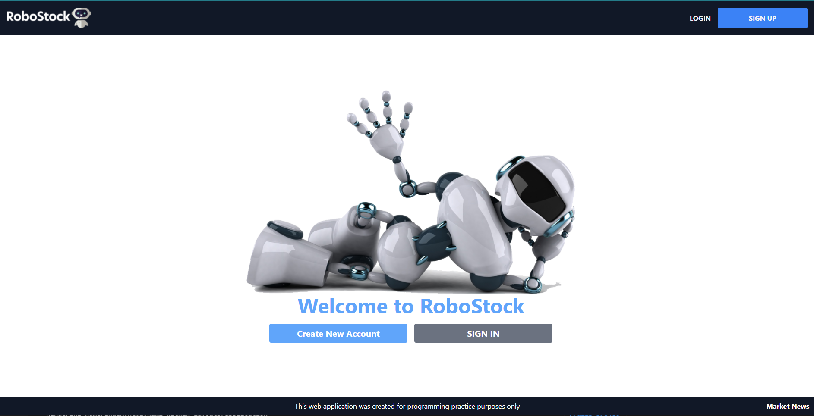
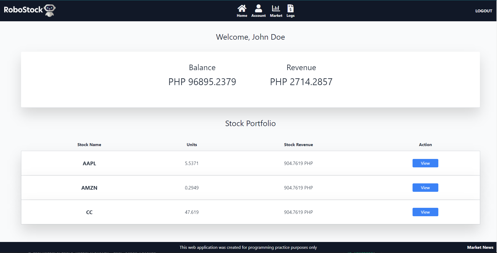
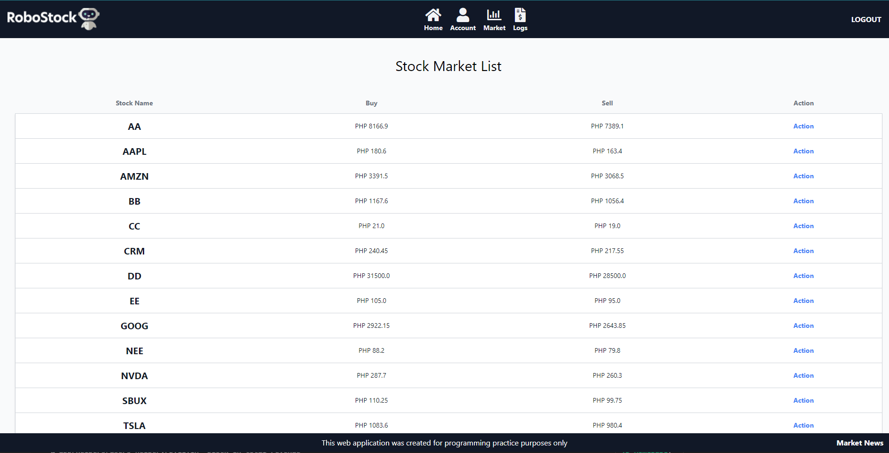
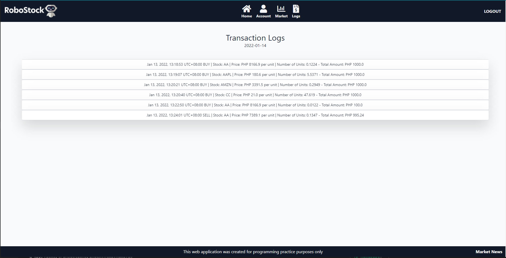
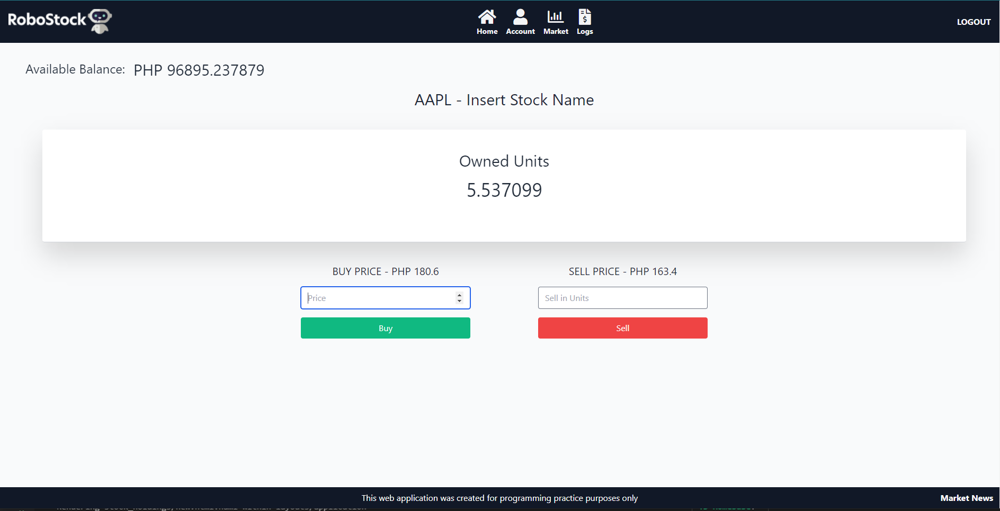
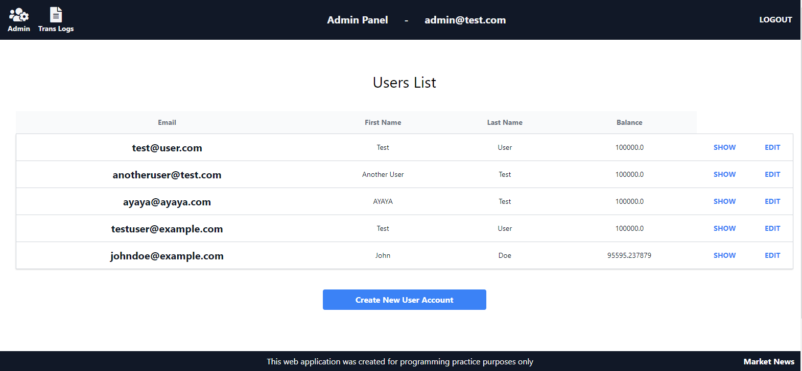

<div id="top"></div>

<!-- [![Contributors][contributors-shield]][contributors-url]
[![Forks][forks-shield]][forks-url]
[![Issues][issues-shield]][issues-url]
[![LinkedIn][linkedin-shield]][linkedin-url] -->

<!-- PROJECT LOGO -->
<br />
<div align="center">
  <a href="https://github.com/github_username/repo_name">
    
  </a>

<h3 align="center">RoboStock Trading App</h3>

  <p align="center">
A basic stock trading application where users can imitate buying and selling of stocks from the stock market.
    <br />
    <a href="https://github.com/idlehands08/stock-trading-app"><strong>Explore the docs »</strong></a>
    <br />
    <br />
  </p>
</div>

<div>

#### View our Demo

#### USER links

#### link 1 - https://robostockapp.herokuapp.com/ 

#### link 2 - https://morning-lake-07067.herokuapp.com/

#### Email: test@user.com

#### Password: 123123

</br>

#### ADMIN links

#### link 1 -https://robostockapp.herokuapp.com/admins/sign_in

#### link 2 - https://morning-lake-07067.herokuapp.com/admins/sign_in

#### Email: admin@test.com

#### Password: 123123

</br>
</br>
</div>
<!-- TABLE OF CONTENTS -->
<details>
  <summary>Table of Contents</summary>
  <ol>
    <li>
      <a href="#about-the-project">About The Project</a>
      <ul>
        <li><a href="#built-with">Built With</a></li>
      </ul>
      <ul>
        <li><a href="#built-with">Version</a></li>
      </ul>
    </li>
    <li>
      <a href="#getting-started">Getting Started</a>
      <ul>
        <li><a href="#prerequisites">Prerequisites</a></li>
      </ul>
      <ul>
        <li><a href="#installation">Installation</a></li>
      </ul>
    </li>
    <li><a href="#screenshots">Screenshots</a></li>
    <li><a href="#features">Features</a></li>
    <li><a href="#contributing">Contributing</a></li>
    <li><a href="#contact">Contact</a></li>
  </ol>
</details>

<!-- ABOUT THE PROJECT -->

## About The Project

    RoboStock is a trading app that was created by the developers to practice and learn how to develop web applications using Ruby on Rails. Users can buy and sell stocks that are available on the application by creating a new trader account. They can also manage all existing users by logging into an admin account. RoboStock also has some additional API features such as displaying up to date stock market news, prices and even displaying random jokes.

<p align="right">(<a href="#top">back to top</a>)</p>

### Built With

- [Ruby](https://www.ruby-lang.org/en/)
- [Ruby on Rails](https://rubyonrails.org/)
- [Tailwind CSS](https://tailwindcss.com/)
- [JQuery](https://jquery.com)

### Version

```
  Ruby 2.7.4
  Rails 6.0.3.6
  Nodejs 12.18.3
  Yarn 1.22.4
```

<p align="right">(<a href="#top">back to top</a>)</p>

<!-- GETTING STARTED -->

## Getting Started

To get a local copy up and running follow these simple example steps.

### Prerequisites

- Must have Ruby on Rails installed on your system in order to edit the app

### Installation

1. Clone the repo
   ```sh
   git clone https://github.com/idlehands08/stock-trading-app.git
   ```
2. Go to your folder and install all the bundles
   ```js
   cd stock-trading-app
   bundle install
   ```
3. Installing yarn
   ```js
   yarn install --check files
   ```
4. Migration
   ```js
   rails db:migrate
   rails db:seed
   ```
5. Start the server
   ```js
   rails server
   ```

<p align="right">(<a href="#top">back to top</a>)</p>

<!-- USAGE EXAMPLES -->

## Screenshots













<p align="right">(<a href="#top">back to top</a>)</p>

## Features

- User can Register and use a Trader account
  - to Buy and Sell Stocks
  - to change their password  
    -to view their transaction logs (buy and sell transaction history)
- User can use an admin account
  - to create a new trader account and add them to the app
  - to view all users currently registered on the app
  - view specific user to show his/her details
  - to edit user details
- Restful API features/functions
  - Get and display Stock Market News from https://marketaux.com -- integrated by idlehands08 / Geoff
  - Get and display recent Stock Prices from https://Stockdata.org -- integrated by idlehands08 / Geoff
  - Get and display random jokes from https://sv443.net/jokeapi/v2/ -- integrated by kobato13 / JC

<p align="right">(<a href="#top">back to top</a>)</p>

<!-- CONTRIBUTING -->

## Contributing

Contributions are what make the open source community such an amazing place to learn, inspire, and create. Any contributions you make are **greatly appreciated**.

If you have a suggestion that would make this better, please fork the repo and create a pull request. You can also simply open an issue with the tag "enhancement".
Don't forget to give the project a star! Thanks again!

1. Fork the Project
2. Create your Feature Branch (`git checkout -b feature/NewFeature`)
3. Commit your Changes (`git commit -m 'Add some NewFeatures'`)
4. Push to the Branch (`git push origin feature/NewFeature`)
5. Open a Pull Request

<p align="right">(<a href="#top">back to top</a>)</p>

<!-- CONTACT -->

## Contact

John Carlo Martinez - [LinkedIn](https://www.linkedin.com/in/john-carlo-martinez-18177314a/) - johncarlomartinez13@gmail.com

Geoff Dagamac - geofftd08@gmail.com

Project Link: [https://github.com/idlehands08/stock-trading-app](https://github.com/idlehands08/stock-trading-app)

<p align="right">(<a href="#top">back to top</a>)</p>
